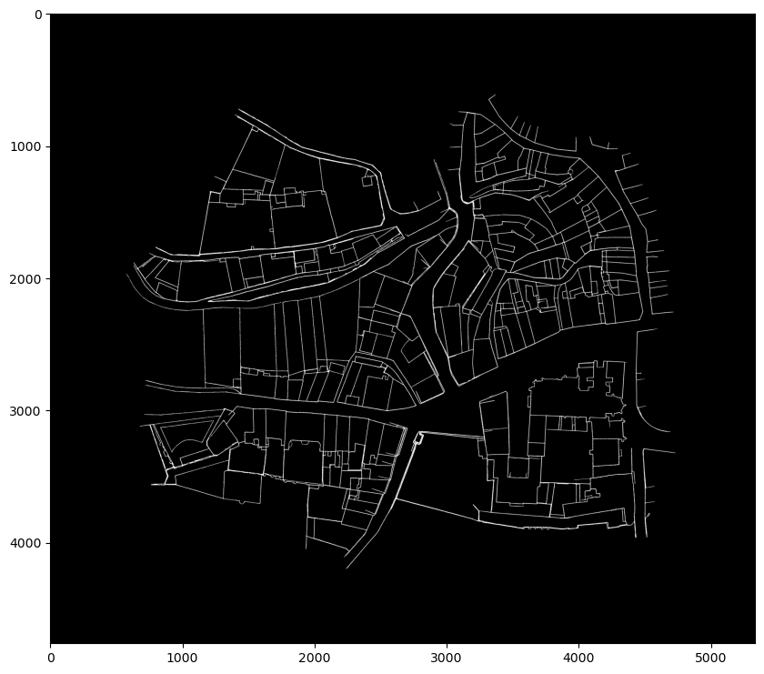

# Automatic georeferencing of historical cadastres

Abstract-This semester project has been hosted by the Digital Humanities Laboratory founded by Professor
Frédéric Kaplan. It will focus on the georeferencing, i.e. spatial recalibration of 19th-century "Napoleonic"
cadastral sheets. This project attempts to address the need for the automatic grouping of huge corpora
like the Napoleonic cadastres. Indeed, a single map at the level of a city or a region would be a significant
tool to facilitate the studies of historians and geographers.
Our method focuses on alignment by pattern matching. A genetic algorithm is used to search for the
match of a pattern in another image. Several patches are extracted from the anchor image, and then, the
best match is employed to compute the homography from the anchor to the target image.
Our best results were obtained with a restricted GA, the loss function Intersection Over Union and a disruptive
selection of the best match.

##

<p align="center">
    
</p>

##
Requirements:
```
geneticalgorithm
opencv-python
scikit-image
Pillow
scipy
numpy
tqdm
json
ast
csv
```
